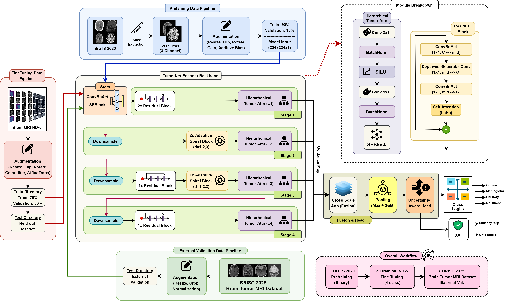

# brain_custom_cnn

This repository contains the **research pipeline** used in our study.

---

## 1) What we did

### Proposed pipeline



1. **Pretrain (BraTS 2020):**
   - Build a **2D slice dataset** from multi-modal MRI (three modalities as channels).
   - Train model on a **binary task** (tumor vs non-tumor slice).
   - Optionally add a **mask-guided attention loss** using BraTS tumor masks.

2. **Fine-tune (Brain MRI ND-5):**
   - Initialize from the BraTS checkpoint.
   - Fine-tune on **4 classes**: glioma, meningioma, pituitary, no-tumor.
   - Use **label-smoothed focal loss** + **uncertainty regularization** + **guidance-map regularization**.

3. **Evaluate (ND-5 test + external):**
   - Deterministic center-crop preprocessing for validation and test.
   - Optional **entropy-weighted test-time augmentation (TTA)**.
   - External validation on **BRISC 2025** and **Mendeley Brain Tumor MRI Dataset** using the same inference protocol.

---

## 2) Datasets (cited)

- **BraTS 2020**: https://www.med.upenn.edu/cbica/brats2020/
- **Brain MRI ND-5**: https://ieee-dataport.org/documents/brain-mri-nd-5-dataset
- **BRISC 2025**: https://arxiv.org/abs/2506.14318
- **Brain Tumor MRI Dataset (Mendeley)**: https://data.mendeley.com/datasets/zwr4ntf94j/5

Please follow each dataset’s license and usage terms.

---

## 3) Reproducible pipeline

### 3.1 Configuration (paths + core hyperparameters)

```python
# CONFIG (edit paths only)
CONFIG = {
    # BraTS (pretrain)
    "BRATS_ROOT": "/input/brats2020-training-data/MICCAI_BraTS2020_TrainingData",
    "BRATS_MODALITIES": ["flair", "t1ce", "t2"],  # 3-channel slice input
    "PRETRAIN_EPOCHS": 10,
    "PRETRAIN_LR": 3e-4,
    "PRETRAIN_BATCH": 10,
    "PRETRAIN_ATTEN_MASK_LOSS": True,   # uses BraTS masks if available
    "LAMBDA_MASK": 0.30,

    # ND-5 (finetune)
    "ND5_ROOT": "/input/brain-mri-nd5-dataset/Brain_MRI_ND-5_Dataset",
    "FINETUNE_EPOCHS": 35,
    "FINETUNE_LR": 2.5e-4,
    "FINETUNE_BATCH": 12,
    "WEIGHT_DECAY": 1e-4,

    # Output
    "OUT_DIR": "/working/journal_brats_pretrain_finetune",
}
```

---

### 3.2 Model forward pass (guidance + uncertainty)

```python
class Proposed_Model(nn.Module):
    def forward(self, x, return_guidance=False, return_uncertainty=False):
        x = self.stem(x)

        x = self.s1a(x); x = self.s1b(x)
        f1, w1, g1 = self.s1h(x)

        x = self.down1(f1); x = self.s2a(x); x = self.s2b(x)
        f2, w2, g2 = self.s2h(x)

        x = self.down2(f2); x = self.s3a(x); x = self.s3b(x)
        f3, w3, g3 = self.s3h(x)

        x = self.down3(f3); x = self.s4a(x); x = self.s4b(x); x = self.s4c(x)
        f4, w4, g4 = self.s4h(x)

        # cross-scale fusion
        f1r, f2r, f3r, f4r = self.cross([f1, f2, f3, f4])

        # guidance aggregation
        g_stack = torch.stack([
            F.interpolate(g1, size=g4.shape[-2:], mode="bilinear", align_corners=False),
            F.interpolate(g2, size=g4.shape[-2:], mode="bilinear", align_corners=False),
            F.interpolate(g3, size=g4.shape[-2:], mode="bilinear", align_corners=False),
            g4
        ], dim=1)
        g_agg = g_stack.mean(dim=1)

        # dual pooling (GeM + GMP)
        gem = self.pool_gem(f4r).flatten(1)
        gmp = self.pool_max(f4r).flatten(1)
        pooled = torch.cat([gem, gmp], dim=1)

        logits, unc = self.head(pooled, return_uncertainty=True)
        if return_uncertainty and return_guidance:
            return logits, g_agg, unc
        if return_uncertainty:
            return logits, unc
        if return_guidance:
            return logits, g_agg
        return logits
```

---

### 3.3 BraTS pretraining loop (binary + optional mask-guided loss)

```python
def pretrain_brats(model, train_loader, val_loader, device, out_dir):
    optimizer = optim.AdamW(
        model.parameters(),
        lr=CONFIG["PRETRAIN_LR"],
        weight_decay=CONFIG["WEIGHT_DECAY"],
    )
    scheduler = CosineAnnealingWarmupRestarts(
        optimizer, T_0=10, T_mult=2, eta_min=CONFIG["PRETRAIN_LR"]*0.01,
        warmup_epochs=2, warmup_start_lr=CONFIG["PRETRAIN_LR"]*0.01
    )

    cls_criterion = FocalLoss(alpha=torch.tensor([1.0, 1.0], device=device),
                              gamma=2.0, label_smoothing=0.0)

    for epoch in range(1, CONFIG["PRETRAIN_EPOCHS"] + 1):
        model.train()
        for batch in train_loader:
            if CONFIG["PRETRAIN_ATTEN_MASK_LOSS"]:
                images, labels, masks = batch
                masks = masks.to(device)
            else:
                images, labels = batch
                masks = None

            images = images.to(device)
            labels = labels.to(device)

            with torch.cuda.amp.autocast(enabled=(device.type == "cuda")):
                logits, guidance = model(images, return_guidance=True)
                loss_cls = cls_criterion(logits, labels)

                # Optional: align guidance map with BraTS tumor masks
                if masks is not None:
                    loss_mask = F.binary_cross_entropy_with_logits(guidance, masks.float())
                    loss = loss_cls + CONFIG["LAMBDA_MASK"] * loss_mask
                else:
                    loss = loss_cls

            # AMP + step (omitted for brevity)
        scheduler.step()
```

---

### 3.4 ND-5 fine-tuning (focal + uncertainty + guidance regularization)

```python
def train_one_epoch_finetune(model, loader, optimizer, device, criterion, scaler):
    model.train()
    for images, labels in loader:
        images = images.to(device)
        labels = labels.to(device)
        optimizer.zero_grad(set_to_none=True)

        with torch.cuda.amp.autocast(enabled=(device.type == "cuda")):
            logits, guidance, unc = model(images, return_guidance=True, return_uncertainty=True)
            cls_loss = criterion(logits, labels)

            pred = logits.argmax(dim=1)
            correct_mask = (pred == labels).float()
            pred_unc = unc[torch.arange(len(labels), device=device), pred]
            unc_loss = (pred_unc * correct_mask).mean()

            # label-only guidance regularizer (tumor classes: 0,1,3)
            tumor_classes = [0, 1, 3]
            is_pos = torch.tensor([1.0 if int(y.item()) in tumor_classes else 0.0
                                   for y in labels], device=device)

            gy = torch.abs(guidance[:, :, 1:, :] - guidance[:, :, :-1, :]).mean()
            gx = torch.abs(guidance[:, :, :, 1:] - guidance[:, :, :, :-1]).mean()
            tv = 0.5 * (gy + gx)

            pos_loss = ((1.0 - guidance) * is_pos.view(-1, 1, 1, 1)).mean()
            neg_loss = (guidance * (1.0 - is_pos).view(-1, 1, 1, 1)).mean()
            hier_loss = pos_loss + neg_loss + 0.1 * tv + 0.05 * guidance.mean()

            loss = cls_loss + 0.1 * unc_loss + 0.2 * hier_loss

        scaler.scale(loss).backward()
        torch.nn.utils.clip_grad_norm_(model.parameters(), max_norm=1.0)
        scaler.step(optimizer)
        scaler.update()
```

---

### 3.5 Entropy-weighted test-time augmentation (optional)

```python
class TestTimeAugmentation:
    @torch.no_grad()
    def predict_probs(self, images):
        out = []
        for i in range(images.size(0)):
            img = images[i:i+1]
            preds, ents = [], []
            for sc in self.scales:
                for hf in self.h_flips:
                    for rot in self.rotations:
                        aug = self._augment(img, sc, hf, rot)
                        probs = F.softmax(self.model(aug), dim=1)
                        ent = -torch.sum(probs * torch.log(probs + 1e-10), dim=1)
                        preds.append(probs); ents.append(ent)

            preds = torch.cat(preds, dim=0)
            ents = torch.cat(ents, dim=0)

            # lower entropy => higher weight
            w = F.softmax(-2.0 * ents, dim=0).unsqueeze(1)
            out.append((preds * w).sum(dim=0, keepdim=True))

        return torch.cat(out, dim=0)
```

---


---

## 4) Outputs we report

- **Learning curves:** train/val loss and accuracy
- **Confusion matrices:** ND-5 test, BRISC 2025, Mendeley test
- **Macro metrics:** Accuracy, Precision, Recall, F1, AUC
- **Additional:** t-SNE embedding visualization and qualitative explainability figures (Grad-CAM++ and saliency)

---

## 5) Citation

If you use this work, please cite the corresponding paper (preprint / final citation will be added here after publication).
